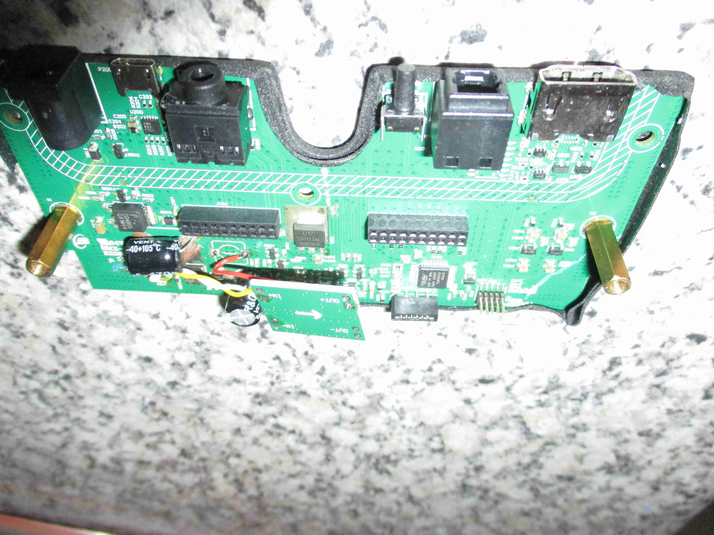
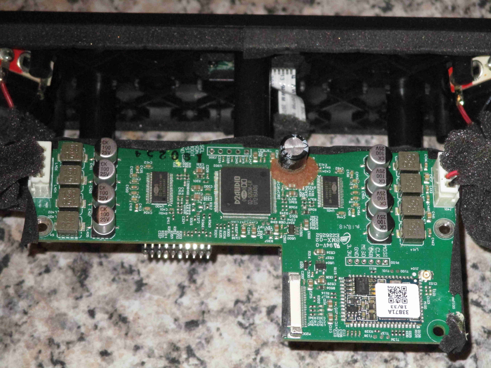
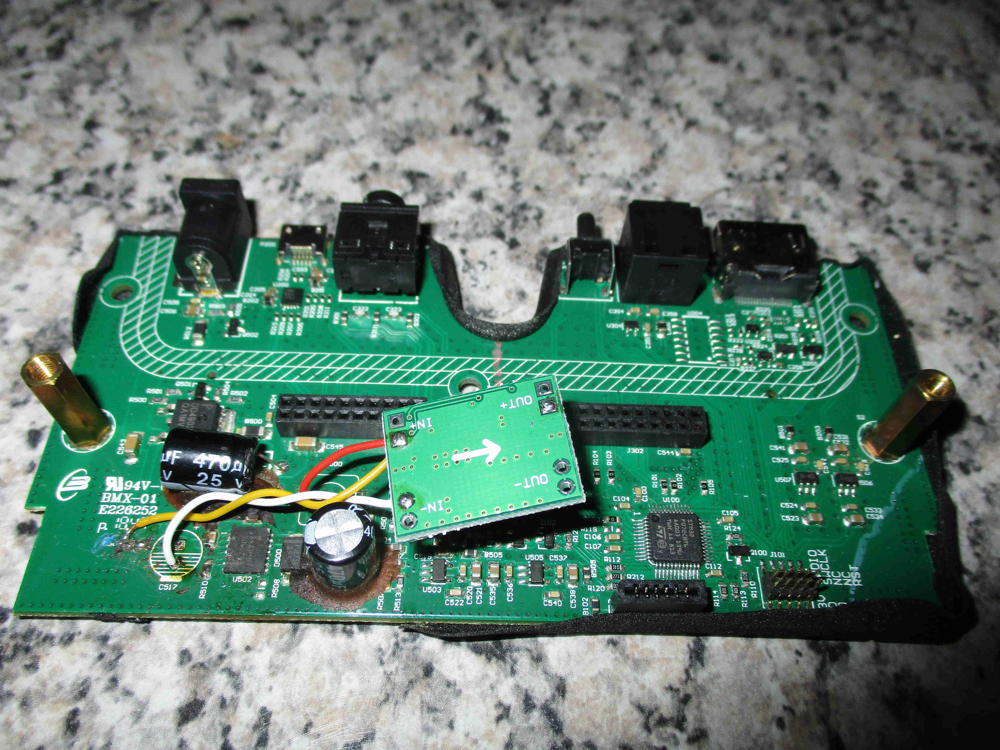

# Teufel Cinebar One (2020) — Auto-On Firmware Mod

The Teufel **Cinebar One (2020)** soundbar has no physical power button — it can only be powered on by IR remote. This repository documents a firmware reverse-engineering effort that adds two features to the bar's stock firmware:

1. **Auto-on** — the bar boots straight into the active audio state when AC power is restored. No remote needed.
2. **Wake-on-SPDIF** — when audio activity returns on the Toslink input after a period of silence, the bar wakes within about 25 ms. After roughly 15 min of silence, it suspends itself again. During suspend the DSP IC is fully powered down, so standby current draw is materially lower than the vanilla firmware.

A third, optional variant additionally **preloads** the bar's persistent settings (volume = 35, mode = Music, bass = +8, modeExtend = ON), so it always comes up at a sensible default.

Product page: <https://li.teufelaudio.com/cinebar-one-2020-105568000>

> *Ironic footnote*: the **2021** revision of the same bar ships with an "auto on" switch on the back that does roughly what this patch does in software. The 2020 model didn't — so we got to do it the hard way.

---

## Quick start

You'll need:

* The bar, opened up. SWD pads are exposed on the main PCB (see [`pictures/`](pictures/) for board photos and the [screw-location map](pictures/screw-locations_1.jpg) for disassembly).
* An **ST-Link** (the cheap V2 clones from AliExpress are fine).
* **OpenOCD** and **Python 3.7+** on your computer.

Steps:

1. **Dump your bar's vanilla firmware** via SWD:
   ```bash
   openocd -f interface/stlink.cfg -f target/stm32f0x.cfg \
           -c "init; reset halt; flash read_bank 0 mydump.bin; exit"
   ```
   Expected: a 131 072-byte file. Keep this safe as your rollback.

2. **Patch** to the recommended variant:
   ```bash
   python3 patcher/build_fw35_from_dump.py mydump.bin firmware_35.bin
   ```
   See [`patcher/README.md`](patcher/README.md) for the other variants (smaller patches, no preloaded state, etc.).

3. **Flash back**:
   ```bash
   openocd -f interface/stlink.cfg -f target/stm32f0x.cfg \
           -c "program firmware_35.bin verify reset exit 0x08000000"
   ```

4. **Reassemble**, plug in AC, watch the bar come up by itself.

---

## What's in this repo

### Tools you'll actually run

| | |
|---|---|
| `patcher/build_fw05_from_dump.py` | Goal #1 only — smallest patch, auto-on, nothing else. |
| `patcher/build_fw22_from_dump.py` | Legacy combined patch (auto-on + wake-on-SPDIF, over-conservative — DSP stays warm in standby). Kept for reference. |
| `patcher/build_fw34_from_dump.py` | Productive base (auto-on + wake-on-SPDIF + DSP fully off in standby). |
| `patcher/build_fw35_from_dump.py` | **Recommended.** `fw_34` + preloaded vol=35 / Music / bass=+8. |
| `build_msc_upload.py` | Build a USB-MSC upload payload from any 128 KB firmware image (see [`MSC_PROTOCOL.md`](MSC_PROTOCOL.md) for the alternative install path). |
| `gdb/` | Productive GDB / OpenOCD helper scripts: `status.sh`, `switch_mode.sh`, `msc_trace.gdb`, `find_ir_pin.gdb`, etc. |

### Reference docs (for the curious)

| | |
|---|---|
| [`RE_JOURNEY.md`](RE_JOURNEY.md) | The whole reverse-engineering story, written as a tutorial. Phases 0–8, plus sidebars for every meaningful dead end. Read this if you want to learn from the process, not just the result. |
| [`symbols.md`](symbols.md) | Every function, RAM address, and pin we identified, with confidence levels (★★★ verified live, ★ static-only inference). The Ghidra label sheet / GDB cheat sheet. |
| [`MSC_PROTOCOL.md`](MSC_PROTOCOL.md) | The bootloader's USB-MSC firmware-update protocol, fully decoded. End-to-end live-validated. |
| [`IR_CODES.md`](IR_CODES.md) | Complete IR remote → command-ID mapping. |
| [`dsp_protocol.md`](dsp_protocol.md) | Renesas D2-92634-LR DSP register map, per-mode preset table. |
| [`CEC_PROTOCOL.md`](CEC_PROTOCOL.md) | HDMI-CEC subsystem (the "service mode" we initially mistook for the MSC entry). |
| [`FIRMWARE_VARIANTS.md`](FIRMWARE_VARIANTS.md) | Every binary we built, productive and dead-end, with status and rationale. |
| [`GOALS_AND_TASKS.md`](GOALS_AND_TASKS.md) | Project log — goals, phases A–J, task index #14–#68. |
| [`SOLUTION.md`](SOLUTION.md) | Concise Goal #1 patch documentation (the auto-on shim). |
| [`SHIMS.md`](SHIMS.md) | Annotated assembly of the patch shims. |
| [`POWER_SEQUENCES.md`](POWER_SEQUENCES.md) | State-machine transitions in active / standby. |

---

## Hardware

| Component | Detail |
|---|---|
| MCU | STM32F072CBT6 (Cortex-M0, 128 KB flash, 16 KB RAM, LQFP48) |
| DSP / amp | Renesas D2-92634-LR on a separate daughter board |
| Toslink input | 3-pin module → STM32 PA4 (raw biphase data) |
| Bluetooth audio | CSR/Qualcomm A64215 on the daughter board |
| Wireless subwoofer link | SWA12-TX (proprietary 2.4 GHz) — separate BT module |
| Status LED | RGB on a small front PCB (6-pin ribbon to baseboard) |
| IR receiver | Low-voltage (1.8 V CMOS) on the same front PCB |

| Baseboard (STM32) | Daughter board (DSP + BT + amp) |
|---|---|
|  |  |

The bar has **exactly one tactile button** on the chassis — labelled SUB PAIRING and normally used to pair a wireless subwoofer. As a happy accident, that same button is also the bootloader's USB-MSC firmware-update entry gesture: holding it while powering on the bar puts it into MSC mode.

---

## USB-MSC firmware-update path (advanced)

Once any working firmware is on the bar, future updates can go over USB instead of SWD:

> Hold **SUB PAIRING** while plugging the USB-C cable in. The bar enumerates as USB Mass Storage (VID `0x2CC2`, PID `0x0004`, label "Teufel CBO", 264 KB FAT12). Drop the upload payload on the volume, then drop a 1-byte `0x00` file to trigger reboot.

dmesg after a successful enumeration:

```
usb X-Y: new full-speed USB device using xhci_hcd
usb X-Y: New USB device found, idVendor=2cc2, idProduct=0004
Product: Teufel Cinebar One
```

Build the upload payload from any 128 KB firmware image:

```bash
python3 build_msc_upload.py firmware_34_pc15-only-keepalive.bin upload.bin
```

**Caveat**: MSC upload writes only the application region (`0x08008000+`). The vEEPROM region (`0x07000+`) is untouched, so the `fw_35` preloaded vol/Music/bass values can NOT be delivered via MSC — only `fw_34`-equivalent behaviour is. For the full `fw_35` preload, SWD-flash.

Full protocol details: [`MSC_PROTOCOL.md`](MSC_PROTOCOL.md).

---

## Backstory

I bought the Cinebar One in 2020 mostly for everyday TV / music listening. The lack of a physical power button was annoying from day one — I lived with an Arduino + IR transmitter wired to a button that fired the power-on/off code on press. It worked but was ugly.

Some years later the bar's **PMIC died** outright. Bar non-functional, but: a good excuse to take the whole thing apart, repair the power supply properly, and finally do the firmware mod while everything was open.

The PMIC bypass on my unit:
* Lifted **one ferrite bead and one 100 µF / 25 V capacitor** on the V<sub>in</sub> path.
* Lifted **the 330 µH inductor** on the V<sub>out</sub> path.
* Dropped in a small **adjustable switch-mode regulator board set to 3.3 V** as a replacement.



That hardware repair is independent of the firmware mod in this repo — mentioning it here only in case anyone else's bar fails the same way.

The reverse-engineering was done in collaboration with **Claude** (Anthropic's coding agent). The agent did the bulk of the disassembly analysis, hypothesis generation, and patch-shim assembly; I provided the bar on the bench, the multimeter, the user-level pushback when something didn't match lived UX, and the live SWD/GDB probing. The collaboration model that emerged — including several days of false starts that turned out to be informative — is documented at length in [`RE_JOURNEY.md`](RE_JOURNEY.md).

---

## What this repo deliberately does NOT contain

* **The Cinebar One firmware itself.** It's © Teufel and is not redistributed here. The patcher scripts work against your own dump.
* **A simple `sha256sum` of "the" vanilla firmware.** A raw SHA isn't meaningful because the bar's **vEEPROM** region (`0x07000–0x077FF`) holds per-bar persistent state (volume, bass, mode history) and naturally differs between otherwise-identical bars. The patcher scripts instead print a **code SHA256** that masks the vEEPROM region — that hash *is* stable across all bars on the same firmware revision. The reference value for the 2020 model's firmware shipped on my unit is `1846aac9…` (full value in the patcher scripts). If your bar shows a different code SHA, the patcher will warn before touching anything.
* **A fix for the occasional audio crackle** that some Cinebar One owners report. The DSP register map is decoded in `dsp_protocol.md` and we ran A/B tests on the likely candidates — bench evidence pointed to intersample peaks at the DAC stage post-DSP, which isn't reachable from firmware.

---

## License

The reverse-engineering work, patcher scripts, GDB helpers, and documentation in this repository are released under the [**MIT License**](LICENSE).

The Cinebar One firmware itself is © Lautsprecher Teufel GmbH and is NOT included or redistributed by this repository. The patcher scripts operate on a firmware dump that you read from your own device.

---

## Disclaimer

This is hobbyist reverse-engineering work shared in good faith. **You modify your bar at your own risk.** SWD-flashing the wrong image can brick the unit until you reflash a known-good dump (which is why "dump your vanilla firmware first" is step 1 of the quick start). The MSC path is safer once it's working, but a partial upload that's interrupted mid-stream also leaves the bar bootloader-only until SWD-recovered. Don't do any of this on a bar you can't afford to brick.

The firmware patches are minimal (one byte to a few hundred) and the bar's bootloader (kept untouched by all patcher variants) is a reliable last-resort recovery path — but no guarantees are made or implied.
